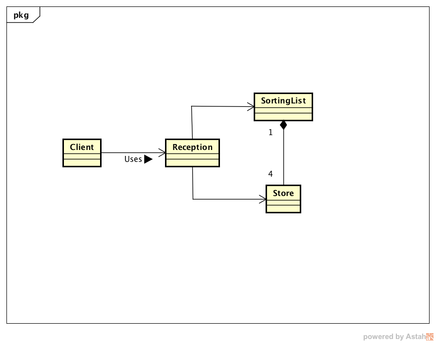
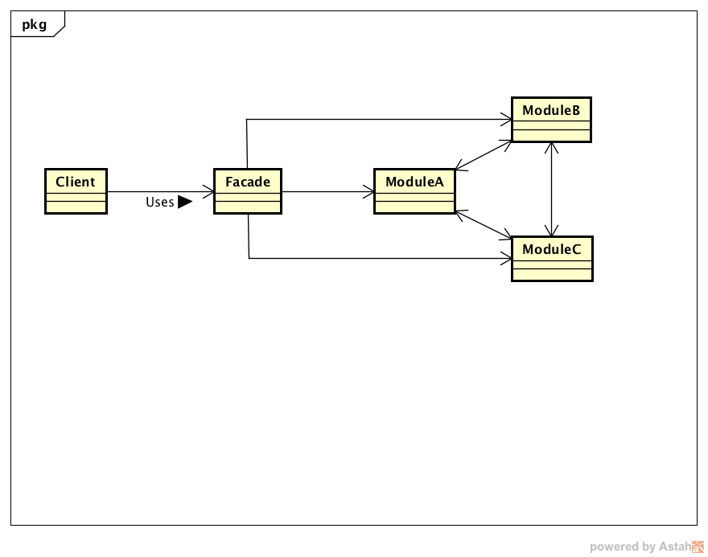

# Ex01-B の 解説

Ex01-Bの問題では、新たに預かり所(Reception)クラスを、作ってもらいました。
このクラスは、客が、倉庫(Store)や仕分けリスト(SotringList)を意識する必要を無くすためです。
こうすることで、インターフェースはシンプルになり抽象度が増します。
預かり所クラスのメソッドの説明を見てみましょう。他のクラスのメソッドに比べて、
説明にプログラミング要素が無く、一般的な預かり所の振る舞いの説明としても、読めるはずです。

**Ex01-Bのクラス図**

Ex01-Bのクラス関係を、より一般的に言うと、複数のモジュール(サブシステム)をクライアントから隠蔽し、
サブシステムの具体性を隠蔽します。サブシステムの隠蔽を行うクラスをFacadeと言い、
このパターンをFacadeパターンと言います。

**Facadeパターンのクラス図**

ここまで説明を聞いて、Facadeパターンは何度も実装した事があり、大したことが無いパターンだと思われるかもしれません。
しかし、これは、とても大きな効果を発揮します。サブシステムの各モジュールの単体テストを行った後、
Facadeクラスが結合テストを行っているのと、同様の効果が得られます。
あなたがライブラリの設計者だったとしましょう。あなたはライブラリを通して、複数のモジュールを公開することにしました。
しかし、ライブラリの使用者は、モジュールを正しく組み合わせて使えませんでした。
このようなとき、モジュールを隠蔽し、シンプルな窓口(Facade)を提供することで、ライブラリ使用者は、
複数のモジュールを間接的に効果的にライブラリを使うことが出来るようになるわけです。

ここまで、Facadeパターンの効果を説明しました。しかし、デザインパターンの本当の効果は、
システムの変更や拡張したときに発揮します。Ex01-Cの問題を通して、効果を実感してください。
しかし、どのような拡張、どのような状況でもFacadeパターンが有効なわけではありません。
詳しくは、[FacadeパターンのWiki](https://ja.wikipedia.org/wiki/Facade_パターン "FacadeパターンのWiki")の
「Facadeパターンの要件」に目を通してください。